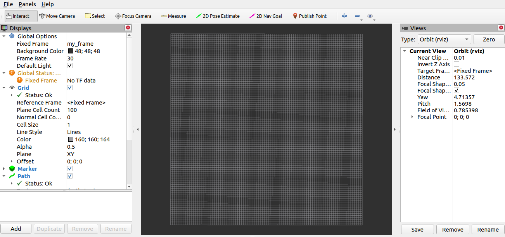
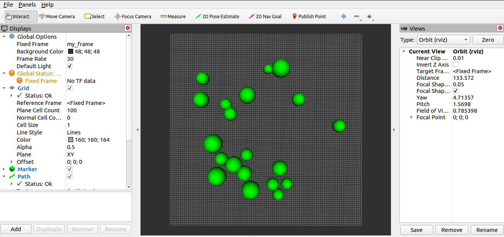
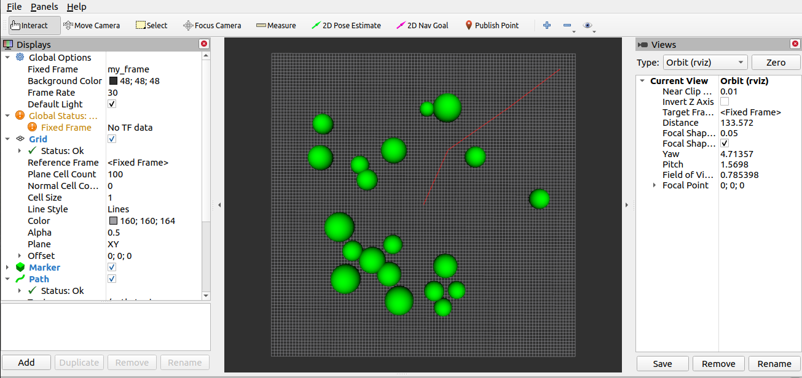

# Procedure

## Assumptions

In this 2D path planning problem, a starting position (start_x, start_y) and a goal position (goal_x, goal_y) is expected to be supplied. The output of the path planner is the computation time as well as the 2D path generated (x and y positions), which is published as nav_msgs/Path and visualized on RVIZ. In a real world robotics example, a controller, which is aware of the robot kinematics and dynamics, is expected to receive those pose commands in nav_msgs/Path and compute the necessary actions to make the robot follow that collision-free path with appropriate speeds.

## Running The Package

Starting the ROS Master:
```
roscore
```

Starting RVIZ with the saved configuration:
```
rosrun rviz rviz -d ~/catkin_ws/src/path_planning_pkg/rviz/path_planning.rviz
```

Starting the path planning server:
```
rosrun path_planning_pkg path_planning_server
```

Starting the path planning client with (0,0) as the starting position and (45,45) as the end goal, for example:
```
rosrun path_planning_pkg path_planning_client 0 0 45 45
```

## Results
Note: the position (0,0) represents exactly the center of the 100x100 grid shown on RVIZ.



After running the server, those randomly placed and randomly sized obstacles will be generated:



A custom starting position and goal positions could be supplied using the client:

```
rosrun path_planning_pkg path_planning_client 0 0 -45 -45
```
Then the path will be generated, as shown by the red line which represent the nav_msgs/Path message:


Another goal could be supplied:

```
rosrun path_planning_pkg path_planning_client 0 0 45 45
```

The planned path:

